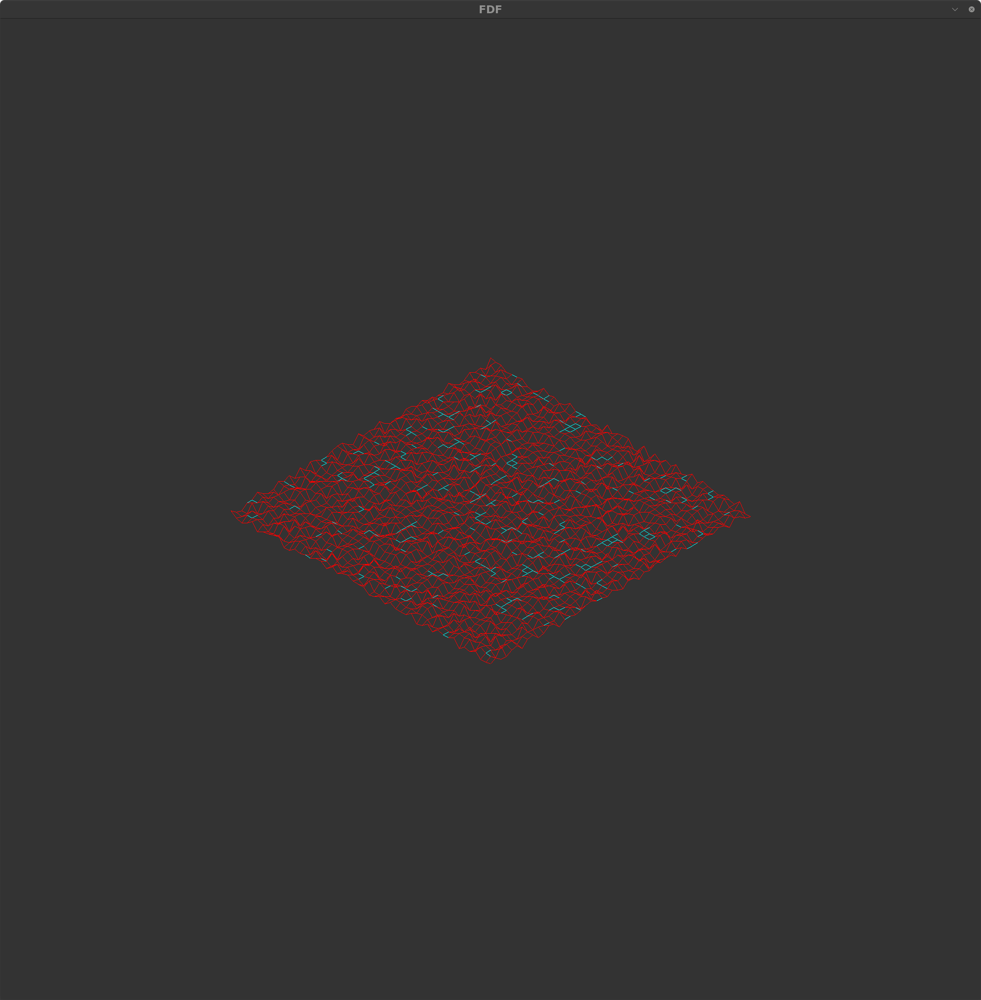
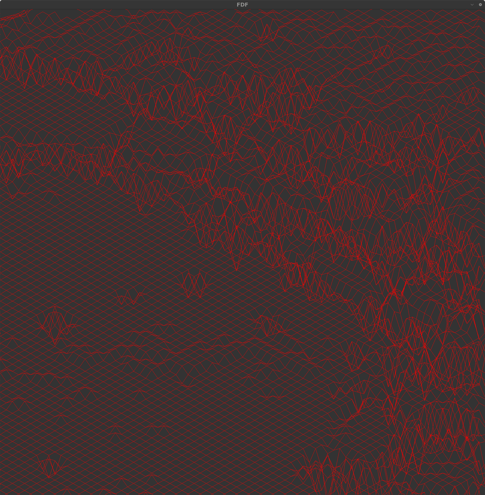

The program reads the coordinates of the landscape from a .fdf file provided as a parameter. Each number in the file represents a point in space, where the horizontal position corresponds to its x-axis, the vertical position corresponds to its y-axis, and the value corresponds to its altitude on the z-axis. The program then renders the landscape in isometric projection using the MiniLibX library.

To build the project, run:
<pre>
make
</pre>

To render a landscape, execute the program with a .fdf file as a parameter:
<pre>
./fdf maps/42.fdf
</pre>
The landscape offers interactive features for manipulation, allowing users to adjust its position, rotation, and zoom level.
Zooming:

    Zoom In: Press 1
    Zoom Out: Press 2

Movement:

    Vertical Movement:
        Up: Press W
        Down: Press S

    Horizontal Movement:
        Left: Press A
        Right: Press D

Rotation:

    Clockwise Rotation: Press =
    Counterclockwise Rotation: Press -

  

